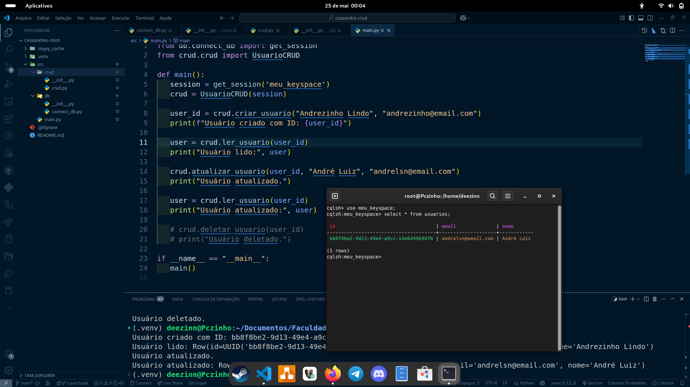

# CRUD com Cassandra em Python 🐍⚙️

Aplicação simples de CRUD usando **Python** com **Apache Cassandra** rodando via **Docker**.

---

## 🔧 Tecnologias
- Python 3.10+
- Apache Cassandra
- Docker
- cassandra-driver (DataStax)

---

